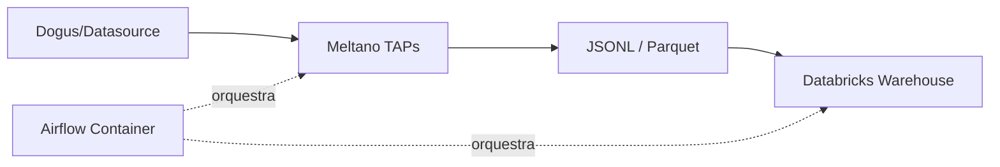

# Data Platform

**Um repositório open-source para construir data platforms escaláveis.**

Este projeto implementa duas soluções **independentes** (sem interações diretas):

1. **dbt** — Transformação pura de dados no Databricks
2. **Meltano + Airflow** — Pipeline completo com orquestração via Airflow Container

> 📌 **Nomenclatura usada neste README:**
> - **Modo A** = dbt puro
> - **Modo B** = Meltano + Airflow (via Docker Compose)

---

## 📚 Sobre este Projeto

Este repositório contém duas soluções independentes que compartilham o mesmo destino (Databricks):

- **Modo A — dbt** : transformação pura de dados já disponíveis no Databricks.
- **Modo B — Meltano + Airflow** : extração e orquestração de dados via TAPs customizados.
- **Digisus Integration** : TAP customizado para integração com DOGUS (Município Inteligente).

> ℹ️ As duas soluções são independentes entre si (não se chamam mutuamente), mas compartilham o mesmo destino final: o **Databricks Warehouse**.

---

## 🛠️ Stack Tecnológico

### dbt Mode (Modo A)

```
Databricks (dados brutos) → dbt → Databricks (modelos transformados)
```

| Ferramenta | Propósito |
|------------|-----------|
| **dbt** | Transformação de dados no Databricks |
| **Databricks** | Data Warehouse destino final |

### Meltano + Airflow Mode (Modo B)



| Ferramenta | Propósito |
|------------|-----------|
| **Meltano** | Orquestração + Extração de dados via TAPS |
| **Custom Airflow DAGs** | Workflows completos via Container |
| **Databricks** | Data Warehouse destino final |

---

## 📋 Requisitos Sistemáticos

### Pré-requisitos Básicos

```bash
Python >= 3.9
pip >= 21.0
Databricks com credenciais e volumes de dados configurados
Docker e Docker Compose - para rodar o Airflow Container (Modo B)
```

---

## 🚀 Instalação MODELO A - Apenas dbt

### Criar Ambiente Virtual do dbt

```bash
# Criar ambiente virtual dbt-core, dbt-parquet, dbt-databricks
python -m venv .dbt-venv

# Windows ou Mac/Linux activate:
# source .dbt-venv/bin/activate (Mac/Linux)
# .dbt-venv\Scripts\activate (Windows)

# Instalar dependências para dbt (Modo A)
pip install -r requirements-dbt.txt
```

---

## 🚀 Instalação MODELO B - Meltano + Airflow

### Criar Ambiente Virtual do Projeto Local

```bash
# Criar ambiente virtual Python para projetos locais e MELTANO
python -m venv .venv

# Windows ou Mac/Linux activate:
# source .venv/bin/activate (Mac/Linux)
# .venv\Scripts\activate (Windows)

# Instalar dependências do Meltano (Modo B)
pip install -r requirements-meltano.txt
```

> ℹ️ O `requirements-meltano.txt` contém as dependências do **Meltano**.
> O Airflow roda em container (Docker Compose), então **não** é instalado aqui.

---

## 🎯 Execução do Projeto — MODELO A (Apenas dbt)

### dbt: Transformação pura no Databricks

> **Pré-requisitos:** ambiente `.dbt-venv` criado e ativado (veja seção de instalação) e arquivo `.env` na raiz do projeto.

> ℹ️ **Sobre o `profiles.yml`:** o dbt procura esse arquivo em `~/.dbt/profiles.yml` por padrão.
> Se o seu estiver em outro lugar (ex.: dentro de `modelagem/`), use `--profiles-dir .` nos comandos.
> Este projeto assume que o `profiles.yml` está no local padrão (`~/.dbt/`).

---

### Passo 1 — Carregar as variáveis de ambiente

A partir da **raiz do projeto** (`data-platform/`), carregue o `.env` conforme o seu shell:

#### 🐧 Git Bash / WSL / Linux / macOS

```bash
set -a; source .env; set +a
```

> 💡 **Por que não `export $(grep -v '^#' .env | xargs)`?**  
> Esse padrão quebra quando os valores contêm espaços (ex.: `FERNET_KEY="abc def"`). O `set -a; source .env; set +a` exporta todas as variáveis com segurança.

#### 🪟 PowerShell

```powershell
Get-Content .env | ForEach-Object {
    if ($_ -match '^\s*([^#][^=]+)=(.*)$') {
        [Environment]::SetEnvironmentVariable($matches[1].Trim(), $matches[2].Trim(), 'Process')
    }
}
```
---

### Passo 2 — Navegar até o diretório do dbt

```bash
cd modelagem
```

---

### Passo 3 — Validar a configuração (recomendado)

Antes de rodar qualquer modelo, confirme que o dbt consegue se conectar ao Databricks:

```bash
dbt debug
```

Você deve ver algo como:

```
All checks passed!
```

Se aparecer erro de conexão, revise as variáveis `DATABRICKS_HOST`, `DATABRICKS_TOKEN` e `DBT_DATABRICKS_TOKEN` no `.env`.

---

### Passo 4 — Executar as transformações

Escolha o comando conforme o que você quer rodar:

```bash
# Rodar todos os modelos do projeto
dbt run

# Rodar apenas um modelo específico
dbt run --select nome_do_modelo

# Rodar um modelo e todos os seus dependentes (downstream)
dbt run --select nome_do_modelo+

# Rodar apenas modelos de uma pasta/tag
dbt run --select tag:staging
```

---

### Passo 5 — (Opcional) Compilar sem executar

Útil para inspecionar o SQL que o dbt vai gerar antes de rodar no Databricks:

```bash
dbt compile --select nome_do_modelo
```

O SQL compilado fica em `target/compiled/`.

---

### Passo 6 — (Opcional) Gerar e visualizar a documentação

```bash
dbt docs generate
dbt docs serve --port 8001   # Airflow está rodando no 8080
```

Abre em `http://localhost:8001` com o lineage e a descrição dos modelos.

---

### 🧪 Testes (em breve)

Este projeto **ainda não possui testes dbt implementados**. Quando forem adicionados, os comandos serão:

```bash
# Rodar todos os testes
dbt test

# Rodar testes de um modelo específico
dbt test --select nome_do_modelo

# Rodar modelo + testes em sequência
dbt build
```

> ⚠️ **Não rode `dbt test` hoje** — ele não vai encontrar nenhum teste e pode retornar vazio ou erro dependendo da versão.

---

### 📋 Resumo dos comandos

| Comando | Quando usar |
|---------|-------------|
| `dbt debug` | Validar conexão antes de tudo |
| `dbt run` | Executar transformações |
| `dbt run --select modelo` | Rodar apenas um modelo |
| `dbt compile` | Ver o SQL gerado sem executar |
| `dbt docs generate` | Gerar documentação |
| `dbt docs serve` | Visualizar documentação |
| `dbt test` | ⏳ Ainda não disponível |

---

### 🛠️ Troubleshooting rápido

| Erro | Causa provável | Solução |
|------|----------------|---------|
| `Could not find profile named '...'` | `profiles.yml` não encontrado em `~/.dbt/` | Crie o arquivo em `~/.dbt/profiles.yml` ou use `--profiles-dir .` |
| `Databricks token invalid` | Token expirado ou variável não carregada | Recarregue o `.env` e valide com `dbt debug` |
| `Relation not found` | Modelo dependente não foi rodado antes | Rode `dbt run` completo ou use `+modelo` |
| `dbt: command not found` | Venv não ativado | Ative `.dbt-venv` |
| `bash: .env: No such file or directory` | Você não está na raiz do projeto | Volte para `data-platform/` antes de carregar o `.env` |

---

### 🔁 Fluxo resumido (Git Bash / WSL)

```bash
# A partir da raiz do projeto
set -a; source .env; set +a
cd modelagem
dbt debug
dbt run
```

---

## 🎯 Execução do Projeto — MODELO B (Meltano via Airflow Container)

### Meltano: Orquestração via Airflow Container Docker

> **Importante:** No Modo B, o **Meltano roda dentro de um Airflow Container** orquestrado por **Docker Compose**. Você **não precisa** ter Airflow ou Meltano instalados localmente — apenas Docker e Docker Compose.

---

### Pré-requisitos

- **Docker** e **Docker Compose** instalados
- Arquivo `.env` na raiz do projeto (usado pelo `docker-compose.yaml` para injetar variáveis no container)
- Porta **8080** livre (interface web do Airflow)

---

### Passo 1 — Navegar até a pasta do Airflow

```bash
cd airflow
```

---

### Passo 2 — Construir a imagem do Airflow

```bash
docker compose build
```

> Esse passo monta a imagem definida no `Dockerfile`, que inclui o Airflow e o Meltano com os TAPs customizados.

---

### Passo 3 — Subir os containers

```bash
docker compose up -d
```

Isso sobe:
- **Airflow** (webserver, scheduler, worker — conforme o `docker-compose.yaml`)
- **PostgreSQL** (metadados do Airflow)

---

### Passo 4 — Verificar se os containers estão rodando

```bash
docker compose ps
```

Você deve ver algo como:

```
NAME                       STATUS
airflow-apiserver-1        running
airflow-scheduler-1        running
airflow-worker-1           running
postgres-1                 running
```

> ⚠️ Os nomes exatos dependem do `docker-compose.yaml`. Use `docker compose ps` para conferir.
> Para listar apenas os **nomes dos serviços**, use `docker compose config --services`.

---

### Passo 5 — Acessar a interface do Airflow

Abra no navegador:

```
http://localhost:8080
```

- **Login:** `airflow`
- **Senha:** `airflow`

> ⚠️ **Conflito de porta:** o Airflow usa a porta **8080** por padrão. Se você também for rodar `dbt docs serve`, use uma porta diferente (ex.: `--port 8001`) para evitar conflito.

---

### Passo 6 — Executar o DAG do pipeline

#### Via interface web

1. Acesse `http://localhost:8080`
2. Vá em **DAGs**
3. Localize o DAG `digisus_pipeline_dag`
4. Clique em **Trigger DAG** (botão ▶️)

---

### Passo 7 — Acompanhar logs

```bash
# Logs de um serviço específico
docker compose logs -f airflow-scheduler

# Logs de todos os serviços
docker compose logs -f
```

---

### Passo 8 — Parar os containers

```bash
# Parar sem remover volumes
docker compose stop

# Parar e remover containers (mantém volumes)
docker compose down

# Parar e remover tudo, incluindo volumes (⚠️ apaga metadados do Airflow)
docker compose down -v
```

---

### 🔧 Variáveis de ambiente no container

As variáveis do `.env` na raiz do projeto são injetadas automaticamente no container pelo `docker-compose.yaml` (via `env_file` ou `environment`). Você **não precisa** carregá-las manualmente.

Para conferir se foram carregadas:

```bash
docker compose exec airflow-apiserver env | grep FERNET_KEY
docker compose exec airflow-apiserver env | grep DATABRICKS_HOST
```

Se aparecerem vazias, revise o `docker-compose.yaml` e o `.env`.

> ⚠️ Os comandos acima usam o nome do **serviço** definido no `docker-compose.yaml`.
> Confira o nome exato com `docker compose config --services`.

---

### 🧪 Testes (em breve)

Este projeto **ainda não possui testes automatizados implementados para o Modo B**. Quando forem adicionados, os comandos previstos serão:

```bash
# Testes do Meltano (quando existirem)
meltano test tap-digisus
```

---

### 🛠️ Troubleshooting rápido

| Erro | Causa provável | Solução |
|------|----------------|---------|
| `port is already allocated` | Porta 8080 em uso (ex.: `dbt docs serve` rodando) | Pare o outro processo ou mude a porta no `docker-compose.yaml` |
| `FERNET_KEY not set` | Variável não injetada no container | Confira o `.env` e o `docker-compose.yaml` |
| `docker compose: command not found` | Docker Compose v2 não instalado | Instale o Docker Desktop ou o plugin `docker-compose-plugin` |
| DAG não aparece na UI | Arquivo `.py` fora de `dags/` ou erro de import | Rode `docker compose logs airflow-scheduler` e verifique |
| `Permission denied` em volumes | UID do container diferente do host | Ajuste `AIRFLOW_UID` no `.env` (padrão: `50000`) |

---

### 🔁 Fluxo resumido

```bash
# A partir da raiz do projeto
cd airflow
docker compose build
docker compose up -d
docker compose ps

# Acesse http://localhost:8080 (airflow / airflow)
# Trigger do DAG digisus_pipeline_dag pela UI

# Para parar
docker compose down
```

---

## 🔧 Configuração (Variáveis de Ambiente)

Consulte **`.env.example`** para o template completo das variáveis necessárias.

### Variáveis do Modo A (dbt):

- Credenciais de Databricks (host, tokens específicos para dbt)
- Configurações do volume/warehouse no Databricks
- Profile name e target configurations

### Variáveis do Modo B (Meltano + Airflow Container):

**Core:**
- `AIRFLOW_UID` - UID para Airflow (padrão: 50000)
- `FERNET_KEY` - Chave criptográfica para segurança do Airflow

**Meltano & Taps:**
- `TAP_DIGISUS_RATE_LIMIT_PER_MINUTE=10`
- `TAP_DIGISUS_RETRY_MODE=false`

---

## 📦 Conectores e Taps Disponíveis

### Tap Digisus - (Custom Tap)

- **Conceito:** Extração de dados municipais via API
- **Formato de destino:** Parquet para o Databricks Warehouse
- **Tabelas alvo:** `municipio_inteligente.raw`

Campos principais:
| Campo | Tipo | Descrição |
|-------|------|-----------|
| `municipio_id` | String | Código da município |
| `ingested_at` | DateTime | Data de ingestão do registro |

---

## 🗃️ Databricks Warehouse (Destino Final para ambos os modos)

Ambos os modos provisionam dados no data warehouse usando:

- **Ingest Target:** `municipio_inteligente.raw`
- **Volume de destino:** `raw`
- **Formatação final:** JSONL → Parquet via dbt transformações
- **Configuradas:** Via credenciais Databricks (`.env`)

---

## 🔒 Segurança

O projeto implementa seguranças críticas:

- **`.env` no `.gitignore`** — Confirme que o arquivo está listado no `.gitignore` e **nunca** o versione.
- **Chaves criptográficas** — Armazenadas no `.env` (nunca versionado). Em produção, migrar para um secret manager (Databricks Secrets, Vault, etc.).
- **`FERNET_KEY`** — Atualmente armazenada no `.env` para desenvolvimento. Em produção, deve ser migrada para o **Databricks Secrets** (ou outro secret manager).
- **Segredos Meltano** — Arquivo separado `.meltano/secret.json`.
- **Logs isolados** — Pasta `logs/` para execução separada de logs.

---

## 📁 Estrutura do Projeto

```
data-platform/
├── .dbt-venv/                    # Modo A: dbt-core, dbt-parquet, dbt-databricks
├── .venv/                        # Modo B: Python projeto local + Meltano
├── digisus-pipeline/             # Conector TAP customizado DOGUS
│   └── tap-digisus/
├── airflow/                      # Workflows completos com Container Docker
│   ├── docker-compose.yaml       # Definição de containers Airflow + PostgreSQL
│   ├── Dockerfile                # Build da imagem Airflow + Meltano
│   ├── dags/                     # DAGs customizados para Pipeline
│   └── digisus-pipeline/         # Conector integrado
├── modelagem/                    # Transformações dbt + plugins Meltano
│   ├── meltano/                  # Plugins customizados de TAPs
│   └── dbt_project.yml           # Configuração do projeto dbt (Modo A)
├── .env                          # Variáveis de ambiente - NÃO VERSIONAR
├── .env.example                  # Template das variáveis para referência
├── requirements-meltano.txt      # Dependências do Meltano (Modo B)
└── README.md                     # Documentação local
```

---

## 📄 Licença
